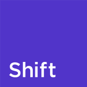
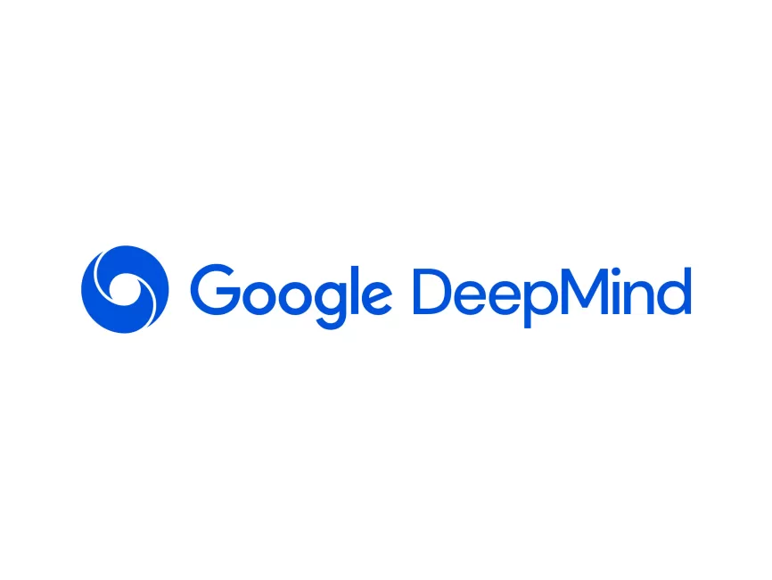
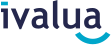
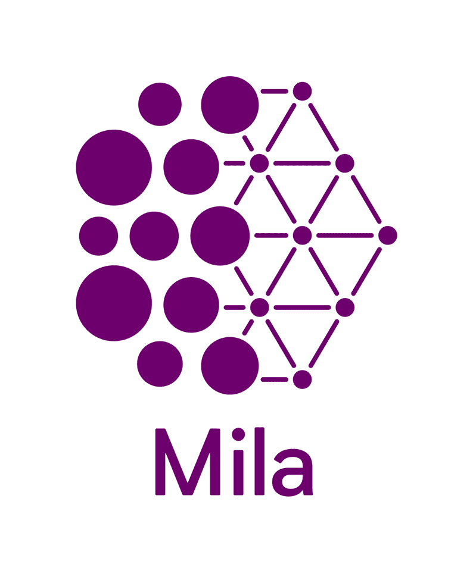
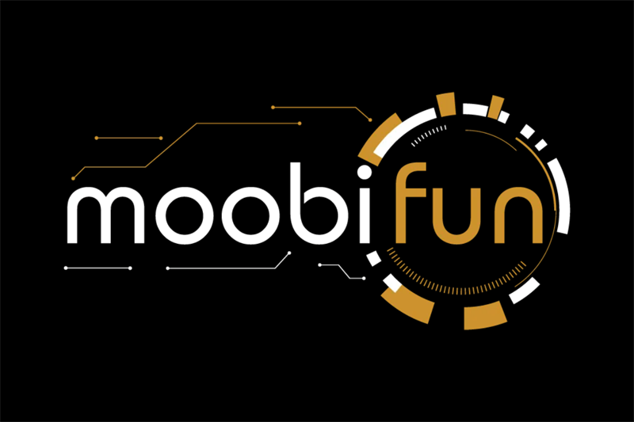
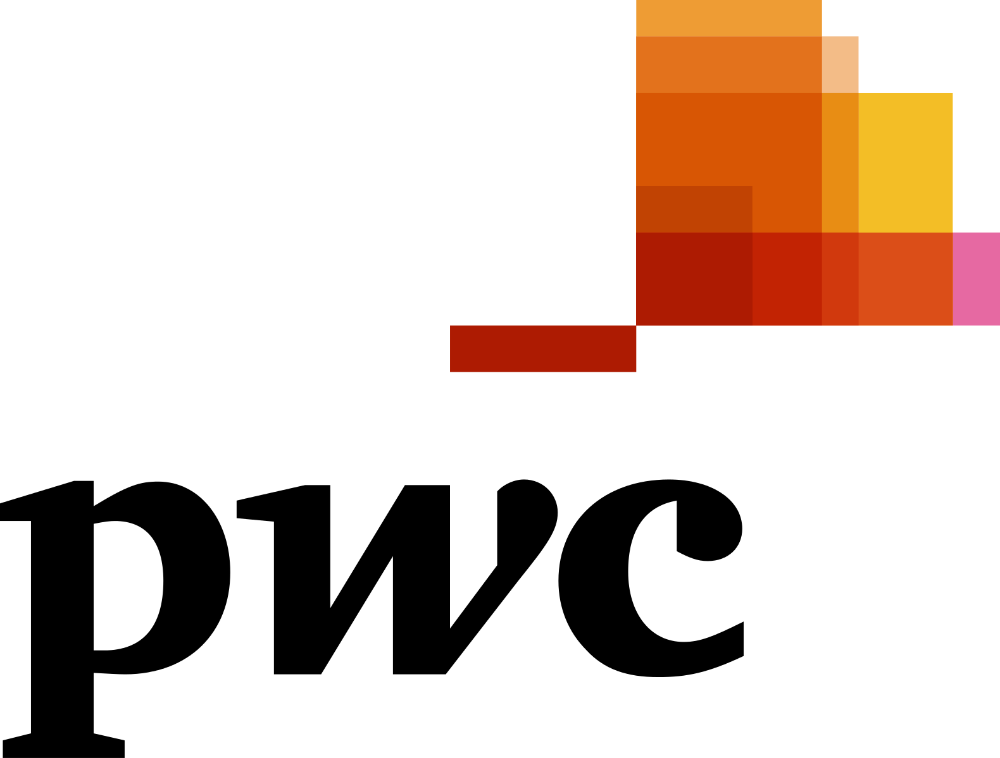
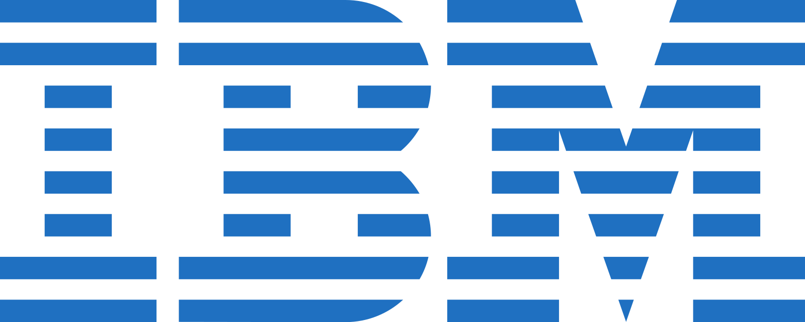

## Who are we ?

We are an organization of engineers and students from [National Advanced School of Engineering of Yaoundé](https://polytechnique.cm/) who are committed to promoting data science, big data and artificial intelligence to solve meaningful problems.

## Members

Our members work in strategic industries and companies/labs.

    
  
  
  
    
  
        

    <!-- -->
    

   
  <!-- Add more logos here -->

## Launching Slides 2024 
Check [the presentation of the activities](https://docs.google.com/presentation/d/1us-JbiBUbHa1EUcBAKsLsyoi6ctkBV-GWhT3xuZC41M/edit?usp=sharing) we are launching this year.

## Activities Planning
The [planning of the activities of the organization](https://docs.google.com/spreadsheets/d/1nOUiLbD_ORuCdC2gXL68n5q23UR9-VPjMqjYB6QLn4E/edit?usp=sharing) is updated as regularly as possible.

## AI Projects COMING SOON
Presentation/code of ongoing/done projects. Check out the [github repo](https://github.com/ENSP-AI-Mentoring).

## Keep Updated with Our Activities
We are committed to fostering an environment rich in diverse perspectives, creativity, empowerment, and active engagement in decision-making. To ensure you never miss out on our activities and opportunities for involvement, please fill out this form.

👉🏾 [SIGN UP TO OUR NEWSLETTER](https://forms.gle/TpZ2VFseFHAemMGv6) 

It's a way to stay automatically updated and to share your valuable insights with us. Whether you want to participate actively or simply leave a comment, we eagerly anticipate hearing from you.

## Drive
This drive contains documents/reports and ressources available about our activities.

[Our Drive for ressources](https://drive.google.com/drive/folders/1Ql9afRElUF-LVzpvrfNuNDqYP_PWnnlj?usp=sharing)

## [Talk to us](https://forms.gle/Gu4EgWbp8RtXCPgf8)

The anonymous box fosters diverse perspectives, creativity, empowerment, and active engagement in decision-making. You can also just make a comment. We look forward to hear your voice.

## Related Initiatives
* [Pipos in AI](https://www.piposinai.com/)
* Machine Learning Project Competition
    > [Facebook post](https://www.facebook.com/blackinai/posts/congratulations-to-james-assiene-for-organizing-the-second-edition-of-the-machin/1043947346361607/)
* [Indaba X Cameroon](https://indabaxcameroon.github.io/)

